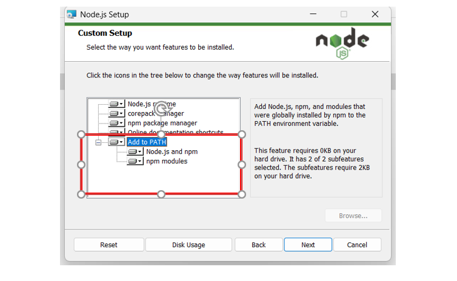

# HSIPL Autotool - 安裝指南

本教學將指引你在 **Windows PowerShell** 上安裝必要環境，包括：

- Node.js
- Python 12
- uv 套件管理器

---

## 1. 安裝 uv

在 PowerShell 中執行以下指令以安裝 uv：

```powershell
powershell -ExecutionPolicy ByPass -c "irm https://astral.sh/uv/install.ps1 | iex"
```

如果安裝 uv 後出現 `找不到 uv` 的錯誤，可以臨時新增路徑環境變數：

```powershell
echo $HOME\.local\bin
```

**複製上方顯示的路徑**，並手動將其新增到系統環境變數中。

---

## 2. 安裝 Node.js

前往 [Node.js 官方網站](https://nodejs.org/en) 下載安裝檔，安裝時請記得勾選 **"Add to PATH"** 選項。



---

## 3. 下載專案

使用 Git 將專案下載至本地端：

```powershell
git clone https://github.com/macchen-yu/HSIPL_auto_fastmcp.git
```

下載完成後，切換至專案資料夾：

```powershell
cd HSIPL_fastmcp
```

---

## 4. 安裝 `server.py`

在 **全局環境**（非虛擬環境）中先安裝 server 相關依賴：

```powershell
uv run fastmcp install server.py
```

⚠️ 注意：**必須在全局環境下執行**！

---

## 5. 設定 `mcpServers` 配置

建立或修改設定檔（例如 `openwebui` 需要的 `openwebui.json`）：

```json
{
  "mcpServers": {
    "hsipl_autotool": {
      "command": "uv",
      "args": [
        "run",
        "fastmcp",
        "run",
        "c:/Users/User/Desktop/HSIPL_fastmcp/server.py"  // 這裡請改成你的實際路徑
      ]
    }
  }
}
```

---

## 6. 除錯開發 MCP Server

啟動 server 端服務器進行開發模式：

```powershell
uv run fastmcp dev server.py
```

啟動成功後，會看到類似下方訊息：

```
Stdio transport: command=C:\Users\User\.local\bin\uv.exe, args=run,--with,mcp,mcp,run,server.py
Spawned stdio transport
Connected MCP client to backing server transport
Created web app transport
Created web app transport
Set up MCP proxy
🔍 MCP Inspector is up and running at http://127.0.0.1:6274 🚀
```

你可以透過瀏覽器開啟 [http://127.0.0.1:6274](http://127.0.0.1:6274) 來查看 **MCP Inspector**。

---

## 參考資料

- [oalieno - MCP 架設教學](https://oalieno.tw/posts/mcp)
- [MCP 官方教學（miniasp 部落格）](https://blog.miniasp.com/post/2025/04/01/Write-your-own-MCP-server-using-uv-and-Python?full=1&fbclid=IwZXh0bgNhZW0CMTEAAR5BtEA-3IpXHd7eI9290Bu_P-TOSgAhOUnEfg1-uOfewPD7xgx1jBPaJdMMWQ_aem_IO-VzLI0yv-h0O69sOEvqg)

---

這版可以直接貼進你的 README.md，用在 GitHub 或文件網站上都很乾淨。

要不要順便也幫你整理一版「中英文對照版」？如果要，我可以快速補給你。要不要一起？🚀